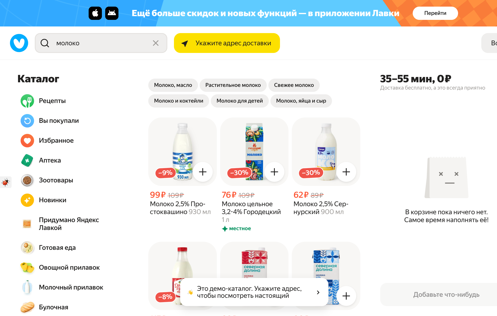
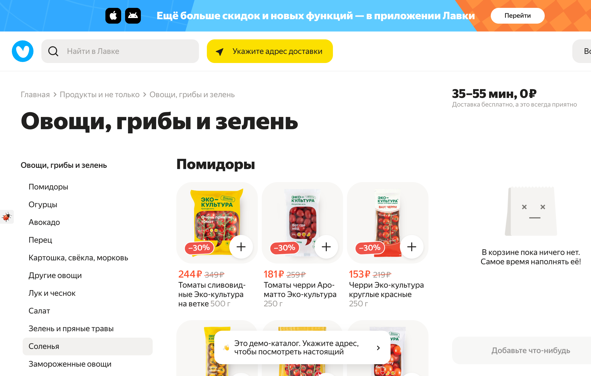

# Техники тест-дизайна: От теории к практике

## 🎯 Что нас ждет сегодня?

Сегодня мы погрузимся в мир техник тест-дизайна — инструментов, которые помогут вам создавать эффективные тестовые наборы и находить больше дефектов, тратя меньше времени.

Техники тест-дизайна — это не просто теория, это ваш инструмент для:

- ✅ **Оптимизации** количества тестов без потери качества
- ✅ **Структурирования** подхода к тестированию
- ✅ **Аргументации** выбора тестовых сценариев перед командой
- ✅ **Нахождения** большего количества багов

**В программе:**

- 🎲 **Эквивалентное разбиение** — как группировать тестовые данные разумно
- 📏 **Граничные значения** — почему баги любят прятаться на границах
- 📊 **Таблицы принятия решений** — структурируем сложную логику
- 🔄 **Диаграммы переходов состояний** — тестируем динамические системы
- 🎯 **Попарное тестирование** — покрываем комбинации параметров
- ❌ **Тестирование предположений об ошибках** — думаем как разработчик
- 📋 **Use Case тестирование** — тестируем реальные пользовательские сценарии

**Для всех примеров мы будем использовать реальный сервис — Яндекс Лавку!** 🛒

---

## 1. Эквивалентное разбиение (Equivalence Partitioning)

### Теория

**Эквивалентное разбиение** — это техника, при которой мы делим множество возможных входных данных на группы (классы эквивалентности), где все элементы одной группы должны обрабатываться системой одинаково.

**Основные принципы:**

- Если одно значение из класса работает, то и все остальные должны работать
- Достаточно протестировать одно значение из каждого класса
- Значительно сокращает количество тестов без потери качества

### Пример из Яндекс Лавки



Рассмотрим поле **поиска товаров** в Яндекс Лавке.

**Классы эквивалентности для поискового запроса:**

| Класс                 | Описание                       | Пример значения                         | Ожидаемый результат                                |
| --------------------- | ------------------------------ | --------------------------------------- | -------------------------------------------------- |
| **Валидные классы**   |
| 1                     | Существующий товар (кириллица) | "молоко"                                | Отображаются товары молочной продукции             |
| 2                     | Существующий товар (латиница)  | "moloko"                                | Отображаются товары или предложение исправления    |
| 3                     | Категория товаров              | "овощи"                                 | Отображается список овощей                         |
| 4                     | Бренд                          | "Простоквашино"                         | Товары данного бренда                              |
| **Невалидные классы** |
| 5                     | Несуществующий товар           | "абракадабра123"                        | Сообщение "Ничего не найдено"                      |
| 6                     | Спецсимволы                    | "!@#$%^&\*()"                           | Сообщение об ошибке или пустой результат           |
| 7                     | Очень длинная строка           | 1000+ символов                          | Обработка или ограничение длины                    |
| 8                     | Пустая строка                  | ""                                      | Отображение популярных товаров или пустая страница |
| 9                     | SQL-инъекция                   | "' OR '1'='1"                           | Безопасная обработка, отсутствие SQL-ошибок        |
| 10                    | XSS                            | "&lt;script&gt;alert(1)&lt;/script&gt;" | Экранирование, отсутствие выполнения скрипта       |

---

## 2. Граничные значения (Boundary Value Analysis)

### Теория

**Анализ граничных значений** — техника, при которой мы тестируем значения на границах классов эквивалентности, так как именно там чаще всего кроются ошибки.

**Правило:** Тестируем:

- Минимальное значение
- Минимальное + 1
- Максимальное - 1
- Максимальное значение
- Значение за пределами границ

### Пример из Яндекс Лавки



Рассмотрим **количество товара** при добавлении в корзину.

**Предположим, ограничения:**

- Минимум: 0 (товар не в корзине)
- Максимум: 99 штук одного товара

**Граничные значения для тестирования:**

| Значение | Тип границы   | Ожидаемый результат                       |
| -------- | ------------- | ----------------------------------------- |
| -1       | За минимумом  | Нельзя ввести или значение не изменяется         |
| 0        | Минимум       | Товар не в корзине, кнопка "+"     |
| 1        | Мин + 1       | Товар добавлен, можно изменить количество |
| 98       | Макс - 1      | Товар добавлен, можно увеличить до 99     |
| 99       | Максимум      | Кнопка увеличения неактивна или скрыта    |
| 100      | За максимумом | Ошибка или ограничение до 99              |

**Тестовый сценарий:**

```
1. Открыть карточку товара "Помидоры черри"
2. Попробовать установить количество -1 → Проверить, что количество остается 0
3. Установить количество 1 → Проверить, что товар добавлен
4. Установить количество 99 → Проверить, что кнопка "В корзину" неактивна
5. Попробовать вручную ввести 100 → Проверить валидацию
```

---

## 3. Таблицы принятия решений (Decision Tables)

### Теория

**Таблица принятия решений** — техника для тестирования систем со сложной бизнес-логикой, где результат зависит от комбинации различных условий.

**Структура таблицы:**

- Условия (Conditions)
- Действия (Actions)
- Правила (Rules) — комбинации условий

### Пример из Яндекс Лавки

Рассмотрим логику применения **скидок и минимальной суммы заказа**.

**Условия:**

- C1: Сумма заказа ≥ минимальной (например, 500₽)
- C2: Есть промокод
- C3: Первый заказ пользователя
- C4: Адрес доставки в зоне обслуживания

**Действия:**

- A1: Заказ принят
- A2: Применена скидка 30% на первый заказ
- A3: Применена скидка по промокоду
- A4: Бесплатная доставка
- A5: Ошибка "Минимальная сумма не достигнута"
- A6: Ошибка "Адрес вне зоны доставки"

**Таблица решений:**

| #                           | Правило 1 | Правило 2 | Правило 3 | Правило 4 | Правило 5 | Правило 6 | Правило 7 | Правило 8 |
| --------------------------- | --------- | --------- | --------- | --------- | --------- | --------- | --------- | --------- |
| **C1: Сумма ≥ минимума**    | ✅        | ✅        | ✅        | ✅        | ✅        | ❌        | ❌        | ✅        |
| **C2: Есть промокод**       | ✅        | ✅        | ❌        | ❌        | ✅        | ✅        | ❌        | ❌        |
| **C3: Первый заказ**        | ✅        | ❌        | ✅        | ❌        | ❌        | ❌        | ❌        | ❌        |
| **C4: Адрес в зоне**        | ✅        | ✅        | ✅        | ✅        | ✅        | ✅        | ✅        | ❌        |
|                             |           |           |           |           |           |           |           |           |
| **A1: Заказ принят**        | ✅        | ✅        | ✅        | ✅        | ✅        | ❌        | ❌        | ❌        |
| **A2: Скидка 30% (первый)** | ✅        | ❌        | ✅        | ❌        | ❌        | ❌        | ❌        | ❌        |
| **A3: Скидка промокода**    | ✅        | ✅        | ❌        | ❌        | ✅        | ❌        | ❌        | ❌        |
| **A4: Бесплатная доставка** | ✅        | ✅        | ✅        | ✅        | ✅        | ❌        | ❌        | ❌        |
| **A5: Ошибка мин. суммы**   | ❌        | ❌        | ❌        | ❌        | ❌        | ✅        | ✅        | ❌        |
| **A6: Ошибка адреса**       | ❌        | ❌        | ❌        | ❌        | ❌        | ❌        | ❌        | ✅        |

**Тестовые сценарии:**

- Для каждого правила (столбца) создаем отдельный тест-кейс
- Всего 8 тест-кейсов для полного покрытия

---

## 4. Диаграммы переходов состояний (State Transition Testing)

### Теория

**Тестирование переходов состояний** — техника для систем, где объект может находиться в различных состояниях и переходить из одного в другое при определенных событиях.

**Элементы:**

- Состояния (States)
- События (Events)
- Переходы (Transitions)
- Действия (Actions)

### Пример из Яндекс Лавки

Рассмотрим **жизненный цикл заказа**.

**Состояния заказа:**

1. **Создан** (Created)
2. **Оплачен** (Paid)
3. **Собирается** (Picking)
4. **В доставке** (Delivering)
5. **Доставлен** (Delivered)
6. **Отменен** (Cancelled)

**Диаграмма переходов:**

```
┌─────────┐
│ Создан  │
└────┬────┘
     │ Оплата успешна
     ↓
┌─────────┐
│ Оплачен │←──────────┐
└────┬────┘           │
     │ Начало сборки  │ Возврат в корзину
     ↓                │
┌───────────┐         │
│ Собирается├─────────┤
└─────┬─────┘         │
      │ Передан курьеру
      ↓               │
┌────────────┐        │
│ В доставке ├────────┤
└──────┬─────┘        │
       │ Доставлен    │
       ↓              │
┌───────────┐         │
│ Доставлен │         │
└───────────┘         │
                      │
     Отмена заказа    │
     ─────────────────┤
                      ↓
                ┌──────────┐
                │ Отменен  │
                └──────────┘
```

**Таблица переходов:**

| Из состояния | Событие          | В состояние | Валидность           |
| ------------ | ---------------- | ----------- | -------------------- |
| Создан       | Оплата           | Оплачен     | ✅ Валидный          |
| Создан       | Отмена           | Отменен     | ✅ Валидный          |
| Оплачен      | Начало сборки    | Собирается  | ✅ Валидный          |
| Оплачен      | Отмена           | Отменен     | ✅ Валидный          |
| Собирается   | Передача курьеру | В доставке  | ✅ Валидный          |
| Собирается   | Отмена           | Отменен     | ✅ Валидный          |
| В доставке   | Доставка         | Доставлен   | ✅ Валидный          |
| В доставке   | Отмена           | Отменен     | ⚠️ Зависит от правил |
| Доставлен    | Отмена           | -           | ❌ Невалидный        |
| Отменен      | Оплата           | -           | ❌ Невалидный        |

---

## 5. Попарное тестирование (Pairwise Testing)

### Теория

**Попарное тестирование** (Pairwise/All-Pairs) — техника, при которой мы тестируем все возможные пары значений для всех комбинаций параметров. Статистически это покрывает до 90% всех дефектов при значительном сокращении количества тестов.

**Преимущество:** Вместо тестирования всех комбинаций (может быть тысячи), мы тестируем только комбинации пар (десятки тестов).

### Пример из Яндекс Лавки


Рассмотрим **фильтрацию товаров** в каталоге.

**Параметры:**

1. **Категория:** Овощи, Фрукты, Молоко
2. **Сортировка:** По популярности, По цене ↑, По цене ↓
3. **Скидка:** Есть скидка, Без скидки
4. **Бренд:** Из Лавки, Простоквашино, Другие

**Полное комбинаторное тестирование:** 3 × 3 × 2 × 3 = **54 теста**

**С использованием Pairwise:** ~**12 тестов** (покрывают все пары)

**Пример pairwise комбинаций:**

| #   | Категория | Сортировка      | Скидка | Бренд         |
| --- | --------- | --------------- | ------ | ------------- |
| 1   | Овощи     | По популярности | Есть   | Из Лавки      |
| 2   | Овощи     | По цене ↑       | Без    | Простоквашино |
| 3   | Овощи     | По цене ↓       | Есть   | Другие        |
| 4   | Фрукты    | По популярности | Без    | Другие        |
| 5   | Фрукты    | По цене ↑       | Есть   | Из Лавки      |
| 6   | Фрукты    | По цене ↓       | Без    | Простоквашино |
| 7   | Молоко    | По популярности | Есть   | Простоквашино |
| 8   | Молоко    | По цене ↑       | Без    | Другие        |
| 9   | Молоко    | По цене ↓       | Есть   | Из Лавки      |

**Инструменты для генерации pairwise:**

- [PICT](https://github.com/Microsoft/pict) от Microsoft
- [AllPairs](http://www.satisfice.com/tools.shtml)
- [Hexawise](https://hexawise.com/)

---

## 6. Предугадывание ошибок (Error Guessing)

### Теория

**Error Guessing** — техника, основанная на опыте и интуиции тестировщика. Мы предполагаем, где могут быть ошибки, основываясь на:

- Предыдущем опыте
- Знании типичных багов
- Понимании архитектуры
- Анализе требований

### Пример из Яндекс Лавки

**Типичные места, где стоит "поискать баги":**

#### 1. **Корзина и расчет стоимости**

- ❌ Добавить товар со скидкой → убрать → добавить снова → проверить, что скидка применилась
- ❌ Добавить 99 единиц товара → проверить корректность расчета
- ❌ Добавить товар → применить промокод → удалить товар → добавить другой → промокод все еще действует?
- ❌ Одновременное изменение количества товара в нескольких вкладках браузера

#### 2. **Поиск товаров**

- ❌ Поиск с опечатками: "малако" вместо "молоко"
- ❌ Поиск на разных языках: "milk", "milch"
- ❌ Поиск с emoji: "🥛 молоко"
- ❌ Быстрая печать → медленный интернет → проверка race conditions

#### 3. **Адрес доставки**

- ❌ Адрес с нестандартными символами
- ❌ Очень длинный адрес
- ❌ Адрес на границе зоны доставки
- ❌ Изменение адреса во время оформления заказа

#### 4. **Оплата**

- ❌ Закрытие вкладки во время оплаты
- ❌ Нажатие кнопки "Оплатить" несколько раз подряд
- ❌ Истечение сессии во время оплаты
- ❌ Изменение цен в корзине во время оплаты

---

## 7. Use Case тестирование

### Теория

**Use Case Testing** — техника, основанная на тестировании реальных пользовательских сценариев. Мы описываем, как пользователь взаимодействует с системой для достижения цели.

**Структура Use Case:**

- Роль (Actor)
- Предусловия (Preconditions)
- Основной сценарий (Main Flow)
- Альтернативные сценарии (Alternative Flows)
- Постусловия (Postconditions)

### Пример из Яндекс Лавки

#### Use Case: "Заказ продуктов с доставкой"

**Роль:** Авторизованный пользователь

**Предусловия:**

- Пользователь авторизован в системе
- Указан адрес доставки
- В каталоге есть доступные товары

**Основной сценарий:**

1. Пользователь открывает главную страницу Яндекс Лавки
2. Система отображает категории товаров
3. Пользователь выбирает категорию "Молочный прилавок"
4. Система отображает список товаров категории
5. Пользователь добавляет "Молоко 2,5% Простоквашино" в корзину
6. Система обновляет счетчик корзины
7. Пользователь добавляет "Хлеб белый" в корзину
8. Пользователь открывает корзину
9. Система показывает итоговую стоимость с учетом доставки
10. Пользователь нажимает "Оформить заказ"
11. Система показывает страницу оплаты
12. Пользователь выбирает способ оплаты "Картой онлайн"
13. Пользователь вводит данные карты
14. Система проводит оплату
15. Система показывает статус заказа "Оплачен, собирается"
16. Система отправляет email с подтверждением

**Постусловия:**

- Заказ создан в системе
- Деньги списаны со счета
- Корзина очищена
- Пользователь получил подтверждение

**Альтернативные сценарии:**

**A1: Товара нет в наличии**

- 5a. Система показывает "Нет в наличии" вместо кнопки "Добавить"
- 5b. Пользователь выбирает другой товар
- 5c. Возврат к шагу 5

**A2: Оплата не прошла**

- 14a. Система показывает ошибку оплаты
- 14b. Пользователь может повторить попытку или выбрать другой способ
- 14c. Возврат к шагу 12

**A3: Минимальная сумма не достигнута**

- 9a. Система показывает сообщение о минимальной сумме заказа
- 9b. Пользователь добавляет товары или отменяет заказ
- 9c. Если добавлены товары → возврат к шагу 9

---

## 📊 Сравнительная таблица техник

| Техника                     | Когда использовать        | Преимущества                | Недостатки                            |
| --------------------------- | ------------------------- | --------------------------- | ------------------------------------- |
| **Эквивалентное разбиение** | Много входных данных      | Сокращает количество тестов | Может пропустить граничные баги       |
| **Граничные значения**      | Числовые поля, диапазоны  | Находит типичные ошибки     | Не покрывает внутренние значения      |
| **Таблицы решений**         | Сложная бизнес-логика     | Структурированный подход    | Трудоемко при большом числе условий   |
| **Переходы состояний**      | Системы с состояниями     | Визуализация потока         | Сложность при большом числе состояний |
| **Pairwise**                | Много параметров          | Резко сокращает тесты       | Не покрывает все комбинации           |
| **Error Guessing**          | Всегда дополнительно      | Находит неочевидные баги    | Зависит от опыта тестировщика         |
| **Use Case**                | Пользовательские сценарии | Проверка реальных потоков   | Может пропустить негативные сценарии  |

---

## 🎯 Практические рекомендации

### 1. Комбинируйте техники

Не используйте только одну технику! Комбинируйте их для максимального покрытия:

- Эквивалентное разбиение + Граничные значения
- Use Case + Error Guessing
- Таблицы решений + Переходы состояний

### 2. Документируйте выбор техник

В тест-плане указывайте, какие техники и почему вы применили для каждого модуля.

### 3. Автоматизируйте рутину

- Используйте инструменты для генерации pairwise комбинаций
- Создавайте шаблоны для таблиц решений
- Используйте mind maps для визуализации техник

### 4. Приоритизируйте

Не нужно применять все техники ко всем функциям:

- **Критичная функциональность:** Все техники + негативное тестирование
- **Средний приоритет:** 2-3 основные техники
- **Низкий приоритет:** Smoke тесты + Error Guessing

---

## 📚 Домашнее задание

### Задание 1: Эквивалентное разбиение 

Для **ввода адреса доставки на странице заказа** в Яндекс Лавке создайте таблицу классов эквивалентности для следующих полей:

- Улица (текстовое поле)
- Домофон (текстовое поле)
- Квартира/офис (необязательное поле)
- Подъезд (числовое поле, необязательное)
- Этаж (числовое поле, необязательное)
- Комментарий курьеру (текстовое поле, необязательное)

Для каждого поля выделите валидные и невалидные классы, приведите примеры значений.

**Формат:** Таблица в формате Markdown

**Пример формата таблицы:**

| Поле  | Класс    | Описание | Пример значения | Ожидаемый результат |
| ----- | -------- | -------- | --------------- | ------------------- |
| Улица | Валидный | ...      | ...             | ...                 |

---

### Задание 2: Граничные значения 

Для функции **"Время доставки"** в Яндекс Лавке (предположим, диапазон: 15-20 минут):

1. Определите граничные значения
2. Создайте таблицу с тестовыми значениями
3. Опишите ожидаемый результат для каждого

**Дополнительно:** Придумайте еще 5 полей/функций Яндекс Лавки, где критичны граничные значения.

---

### Задание 3: Таблица принятия решений 

Создайте таблицу принятия решений для функции **"Доступность товара для заказа"**.

**Условия:**

- Товар в наличии (да/нет)
- Адрес в зоне доставки (да/нет)
- Время работы (в рабочие часы / вне рабочих часов)
- Минимальная сумма заказа достигнута (да/нет)

**Действия:**

- Товар можно добавить в корзину
- Показать сообщение "Товар недоступен"
- Показать сообщение "Адрес вне зоны"
- Показать сообщение "Доставка недоступна сейчас"
- Показать сообщение о минимальной сумме

Создайте полную таблицу и определите, сколько тест-кейсов необходимо.

---

### Задание 4: Диаграмма переходов 

Нарисуйте диаграмму переходов состояний для **товара в корзине**:

**Возможные состояния:**

- Не в корзине
- В корзине
- Оформлен в заказе
- Куплен
- Удален из корзины

**События:**

- Добавить в корзину
- Удалить из корзины
- Оформить заказ
- Оплатить заказ
- Отменить заказ

Создайте:

1. Диаграмму переходов (можно от руки или в любом инструменте)
2. Таблицу валидных и невалидных переходов
3. Список тест-кейсов для проверки всех переходов

---

### Задание 5: Pairwise тестирование 

Для страницы **"Результаты поиска"** в Яндекс Лавке примените pairwise тестирование.

**Параметры:**

- Тип запроса: Название товара, Категория, Бренд
- Наличие: В наличии, Под заказ, Нет в наличии
- Ценовой диапазон: 0-100₽, 100-500₽, 500+₽
- Сортировка: По популярности, По возрастанию цены, По убыванию цены

**Задачи:**

1. Посчитайте количество тестов при полном комбинаторном тестировании
2. Используйте инструмент PICT или аналог для генерации pairwise комбинаций
3. Сравните количество тестов
4. Создайте 3 тест-кейса из сгенерированных комбинаций

---

### Задание 6: Error Guessing 

На основе вашего опыта использования онлайн-магазинов, составьте список из **10 потенциальных багов** в Яндекс Лавке, которые вы бы проверили в первую очередь.

Для каждого бага укажите:

- Описание потенциального бага
- Область приложения
- Шаги для воспроизведения
- Ожидаемый результат
- Приоритет проверки (Высокий/Средний/Низкий)

**Пример:**

```
1. Баг: Двойное списание при повторном нажатии кнопки "Оплатить"
   Область: Оплата заказа
   Шаги:
     - Оформить заказ
     - На странице оплаты быстро нажать кнопку "Оплатить" 2 раза
   Ожидаемый результат: Деньги списаны один раз, создан один заказ
   Приоритет: Высокий
```

---

### Задание 7: Use Case 

Создайте полный Use Case для сценария **"Повторный заказ из истории"**.

Должен включать:

- Название Use Case
- Актор
- Предусловия
- Основной сценарий (минимум 8 шагов)
- Минимум 3 альтернативных сценария
- Постусловия

---

### Задание 8: Комплексное тестирование

Выберите **любую функцию** Яндекс Лавки (например, "сортировки в каталоге",  "Промокоды") и:

1. Примените **минимум 4 техники** тест-дизайна
2. Создайте не менее 15 тест-кейсов
3. Составьте mind map, показывающую, какие техники вы применили и почему
4. Опишите, какие баги вы ожидаете найти с помощью каждой техники

**Формат сдачи:** Документ с описанием + Mind Map (screenshot или ссылка)


---

## 📖 Полезные ресурсы

### Книги

- 📚 **"Software Testing Techniques"** — Boris Beizer (классика)
- 📚 **"Тестирование программного обеспечения. Базовый курс"** — Святослав Куликов

### Инструменты

- 🛠️ **PICT** — Pairwise инструмент от Microsoft
- 🛠️ **Xmind / MindMeister** — Mind mapping
- 🛠️ **Draw.io / Lucidchart** — Диаграммы
- 🛠️ **TestRail / Zephyr** — Test Management с поддержкой техник

### Онлайн ресурсы

- 🌐 [Мой канал в ТГ](https://t.me/qabigtech) — Про обеспечение качества изнутри
- 🌐 [Чат взаимопомощи QA](https://t.me/+NT-IOeLALxszN2Zi) — Чат взаимопомощи QA
- 🌐 [ISTQB Glossary](https://glossary.istqb.org/) — Терминология тестирования
- 🌐 [qa_bible](https://vladislaveremeev.gitbook.io/qa_bible/test-dizain/test-dizain-i-tekhniki-test-dizaina-test-design-and-software-testing-techniques) — Туториалы по тестированию

---

## 💡 Заключение

**Помните:** Нет одной "правильной" техники. Успешный тестировщик знает все техники и умеет выбирать подходящую для каждой ситуации!
